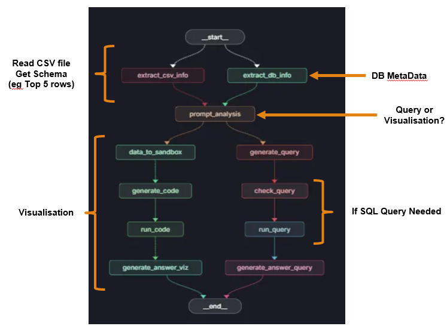

# AI Data Analyst


# sample working demos
https://youtu.be/M2rnEIAOEQg
https://youtu.be/E_ioIjX4nzM

## Overview

AI Data Analyst is an open-source platform designed to automate and enhance data analysis workflows using advanced AI agents. It enables seamless integration of data ingestion, processing, visualization, and reporting, empowering analysts and organizations to unlock actionable insights with minimal manual intervention.

---

## Features

- **Automated Data Ingestion**: Effortlessly import CSV, database, and API data sources.
- **Intelligent Analysis**: Leverage AI agents for statistical analysis, anomaly detection, and predictive modeling.
- **Natural Language Queries**: Interact with your data using conversational AI.
- **Visualization**: Generate beautiful charts and dashboards.
- **Extensible Architecture**: Modular agent system for custom workflows.
- **Secure & Scalable**: Enterprise-ready with environment-based configuration and robust backend.

---

## Getting Started

### Prerequisites
- Python 3.11+
- `pip`
### Installation

```bash
# Clone the repository
$ git clone https://github.com/pushpitkamboj/AIDataAnalyst
$ cd AIDataAnalyst

# Install dependencies
$ pip install -r pyproject.toml
```

### Configuration

Copy `.env.example` to `.env` and update the values as needed:

```bash
cp .env.example .env
```

---

## Usage

Run the main agent:

```bash
python main.py
```

---

## Architecture



for more detailed documentation, refer to https://docs.google.com/presentation/d/1Y1Hrf8_KEyrQQWmSvefEJwINP4l3rXOz/edit?usp=sharing&ouid=103413741594923457323&rtpof=true&sd=true


---

