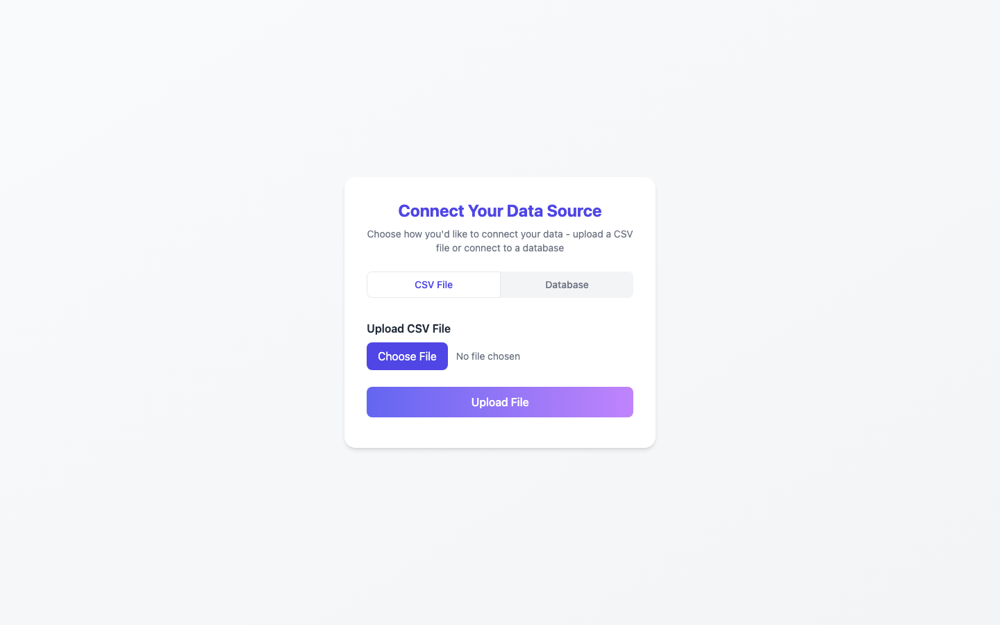

<h1 align="center">AI Data Analyst</h1>

<p align="center">
  Upload a CSV or connect a database, ask questions in plain English, and get tables, summaries, or charts back.
</p>

<p align="center">
  <a href="https://aidataanalyst.pushpitkamboj.com">Live App</a> |
  <a href="#product-snapshot">Snapshot</a> |
  <a href="#architecture">Architecture</a> |
  <a href="#tools-and-technologies">Tech Stack</a> |
  <a href="#local-setup">Run locally</a>
</p>

<p align="center">
  
  
  
  
  
  
  
</p>

AI Data Analyst is a no-code analysis app for CSV files and relational databases. It inspects the provided data source, decides whether the user needs a SQL answer or a visualization, generates the right query or code, executes it, and returns a concise result.

## Product Snapshot

<p align="center">
  
</p>

The app starts with a simple data-source picker. Users can upload a CSV file or provide a database URL, then move into a chat-style analysis flow.

## What It Does

| Capability | Description |
| --- | --- |
| CSV upload | Uploads CSV files and stores them in Supabase Storage. |
| Database input | Accepts relational database URLs and reads schema metadata through SQLAlchemy. |
| Natural-language analysis | Converts plain-English questions into SQL or visualization workflows. |
| SQL answers | Generates, validates, executes, and summarizes SQL query results. |
| Visual analysis | Generates Python chart code and runs it inside an E2B sandbox. |
| Artifact storage | Stores generated chart images in Supabase and returns public URLs. |

## Why Not Just Use ChatGPT?

AI Data Analyst is built for users who want the convenience of an AI analyst without handing database API keys directly to a general-purpose chat product. Secrets stay in your own deployment environment, and database access flows through this app's backend instead of being pasted into an external assistant.

It is also open source, so the trust model is inspectable: you can read the code, see how uploads, database URLs, query generation, and execution are handled, and change anything that does not match your security posture.

The product UX is purpose-built for data analysis. Instead of a generic chat upload flow, the app separates CSV/database connection, schema extraction, query answering, visualization, and artifact storage. It can also work with large CSV files, including million-row datasets, where general chat tools often hit upload or context limits.

## Architecture

<p align="center">
  
</p>

## Tools And Technologies

| Layer | Tools |
| --- | --- |
| Frontend | HTML, Tailwind CSS, vanilla JavaScript |
| API | FastAPI, Uvicorn, Pydantic settings |
| Agent workflow | LangGraph, OpenAI, LangChain model bindings |
| Data execution | DuckDB for CSV queries, SQLAlchemy for database URLs, pandas for tabular results |
| Visualization | E2B Code Interpreter sandbox, Python chart generation |
| Storage | Supabase Storage for CSV files and generated images |
| Deployment | Docker Compose, Caddy reverse proxy, Hostinger VPS |
| CI/CD | GitHub Actions |
| Documentation | Mermaid CLI for generated architecture diagrams |

## Analysis Flow

| Step | What happens |
| --- | --- |
| 1 | User uploads a CSV or submits a database URL. |
| 2 | `/upload` stores CSV files in Supabase, while database URLs pass directly into the analysis flow. |
| 3 | `/query` invokes the LangGraph analyst agent with the user's question and data source. |
| 4 | The agent extracts schema/sample metadata and classifies the request as SQL or visualization. |
| 5 | SQL requests run through DuckDB or SQLAlchemy; visualization requests run generated Python code in E2B. |
| 6 | The API returns rows, summaries, and chart image URLs. |

## API Surface

| Endpoint | Purpose |
| --- | --- |
| `GET /health` | Health check for the deployed API. |
| `POST /upload` | Upload a CSV file or pass through a database URL. |
| `POST /query` | Ask a question against a `csv_url` or `db_url`. |

Example query payload:

```json
{
  "query": "What is the total revenue by region?",
  "csv_url": "https://..."
}
```

## Environment

| Variable | Purpose |
| --- | --- |
| `OPENAI_API_KEY` | Model calls for query, code, and answer generation. |
| `E2B_API_KEY` | Sandboxed Python execution for visualizations. |
| `SUPABASE_URL` | Supabase project URL. |
| `SUPABASE_KEY` | Supabase service/API key. |
| `CSV_BUCKET_NAME` | Bucket for uploaded CSV files. Defaults to `data_csv`. |
| `IMAGE_BUCKET_NAME` | Bucket for generated chart images. Defaults to `data_image`. |
| `DATABASE_URL` | Optional local/default database URL for development. |

## Deployment

Production is deployed at:

```text
https://aidataanalyst.pushpitkamboj.com
```

The Hostinger VPS stack runs the FastAPI app behind Caddy with automatic HTTPS. GitHub Actions are included for CI and Hostinger deployment.

## License

MIT

## Local Setup

Requires Python 3.11+.

```bash
git clone https://github.com/pushpitkamboj/AIDataAnalyst
cd AIDataAnalyst
python3 -m venv .venv
source .venv/bin/activate
pip install -r requirements.txt
```

Create `.env`:

```env
OPENAI_API_KEY=
E2B_API_KEY=
SUPABASE_URL=
SUPABASE_KEY=
CSV_BUCKET_NAME=data_csv
IMAGE_BUCKET_NAME=data_image
```

Run the app:

```bash
PYTHONPATH=src uvicorn api.main:app --reload --host 127.0.0.1 --port 8000
```

Open:

```text
http://127.0.0.1:8000
```

Or run with Docker:

```bash
docker compose up --build
```
